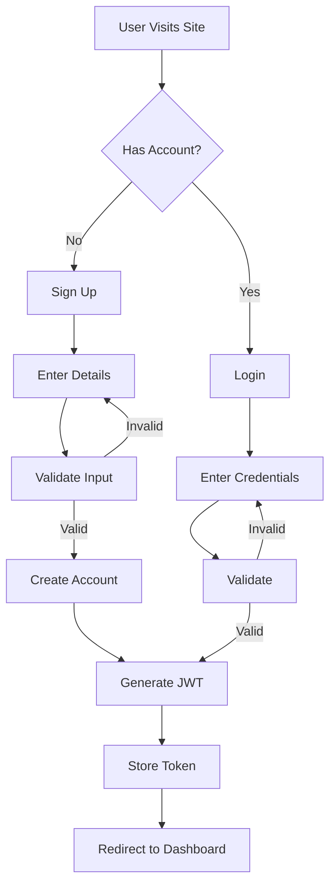
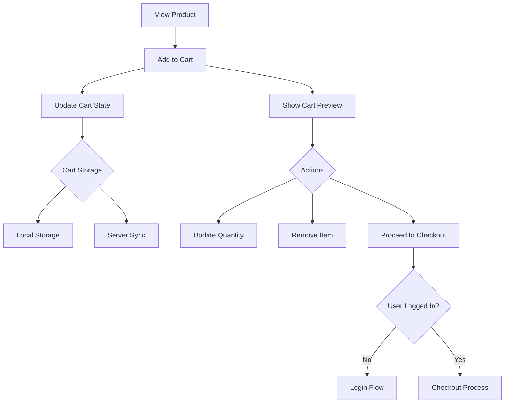
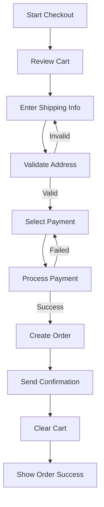
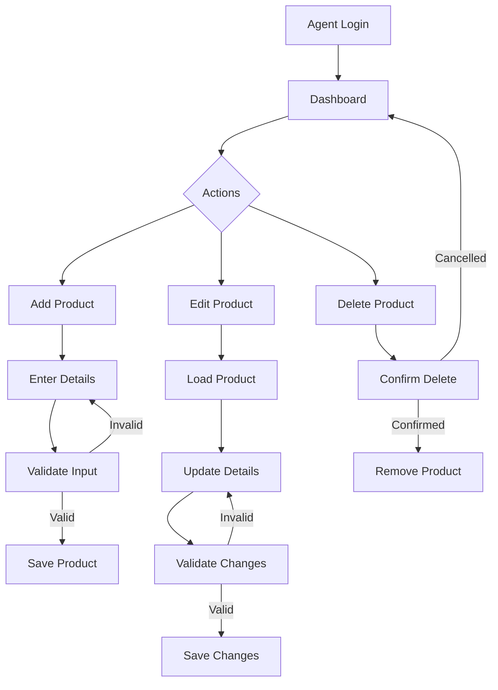
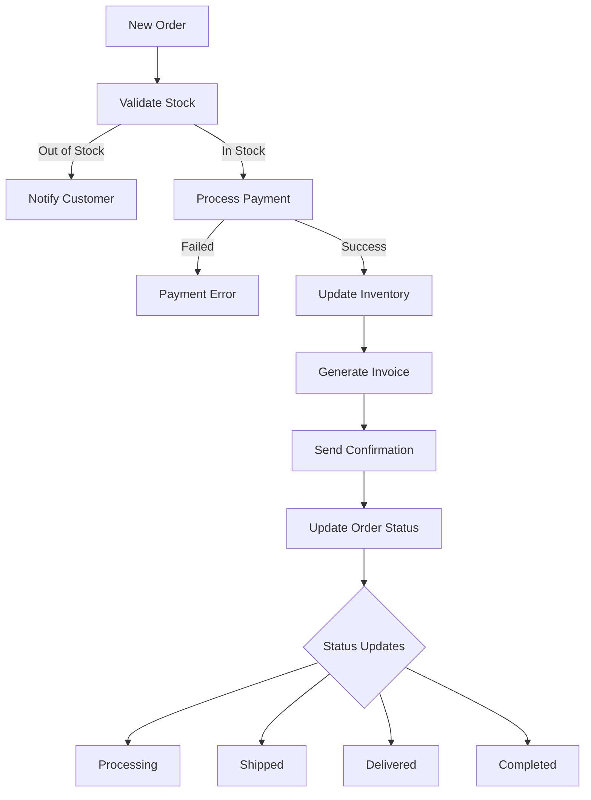
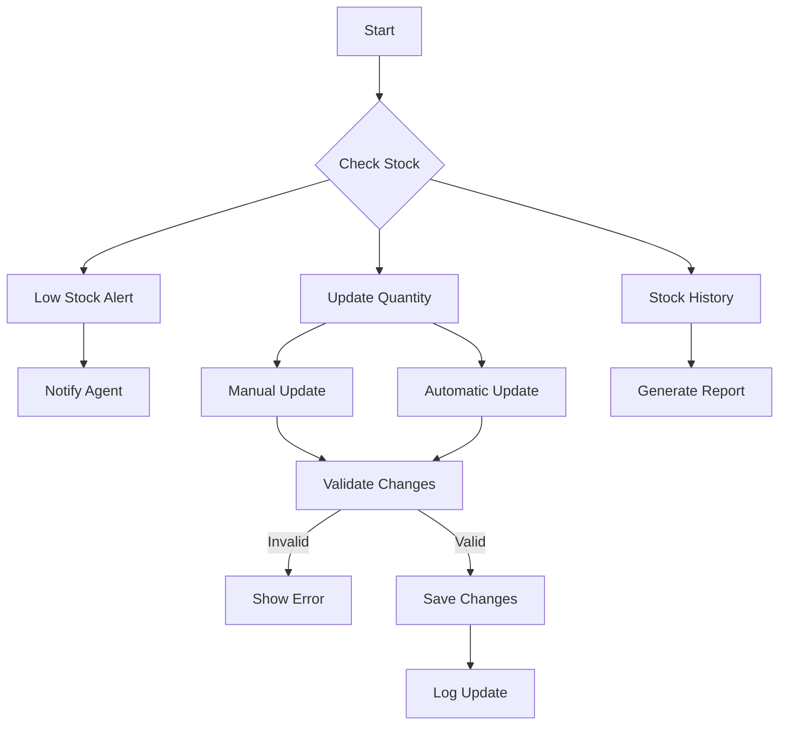

# SupaGrocery Technical Documentation

## Table of Contents
1. [Architecture Overview](#architecture-overview)
2. [Component Design](#component-design)
3. [Data Models](#data-models)
4. [API Documentation](#api-documentation)
5. [Development Guidelines](#development-guidelines)
6. [Testing Strategy](#testing-strategy)
7. [Deployment Process](#deployment-process)
8. [Security Considerations](#security-considerations)
9. [Performance Optimization](#performance-optimization)
10. [Troubleshooting Guide](#troubleshooting-guide)

## Architecture Overview

### System Architecture
The SupaGrocery platform follows a client-server architecture with the following key components:

- **Frontend Layer**: Static HTML/CSS/JS served via Vercel's edge network
- **API Layer**: Serverless functions handling business logic
- **Data Layer**: In-memory storage (mock database)

### Key Design Decisions
- **Stateless Architecture**: All API endpoints are designed to be stateless
- **Edge Computing**: Leveraging Vercel's edge network for optimal performance
- **Progressive Enhancement**: Core functionality works without JavaScript
- **Mobile-First Design**: Responsive design principles applied throughout

## Flow Charts

### User Authentication Flow


### Shopping Cart Flow


### Checkout Process Flow


### Product Management Flow


### Order Processing Flow


### Inventory Management Flow


## Component Design

### Frontend Components
1. **Product Listing**
   - Grid-based layout
   - Lazy loading for images
   - Client-side filtering and sorting
   - Responsive breakpoints

2. **Shopping Cart**
   - Local storage persistence
   - Real-time price calculations
   - Quantity validation
   - Cart synchronization

3. **Checkout Flow**
   - Multi-step form design
   - Form validation
   - Payment processing integration
   - Order confirmation

### Backend Components
1. **Authentication Service**
   - JWT-based authentication
   - Role-based access control
   - Session management

2. **Product Service**
   - CRUD operations
   - Search functionality
   - Category management
   - Inventory tracking

3. **Order Service**
   - Order processing
   - Status management
   - Email notifications

## Data Models

### Product Schema
```javascript
{
  id: string,
  name: string,
  description: string,
  price: number,
  category: string,
  inventory: number,
  created_at: timestamp,
  updated_at: timestamp
}
```

### Order Schema
```javascript
{
  id: string,
  user_id: string,
  items: Array<{
    product_id: string,
    quantity: number,
    price: number
  }>,
  total: number,
  status: string,
  shipping_address: Address,
  created_at: timestamp
}
```

### User Schema
```javascript
{
  id: string,
  email: string,
  role: 'customer' | 'agent',
  created_at: timestamp
}
```

## API Documentation

### Authentication Endpoints

#### POST /api/auth/login
Login endpoint for both customers and agents.

Request:
```javascript
{
  "email": string,
  "password": string
}
```

Response:
```javascript
{
  "token": string,
  "user": User
}
```

### Product Endpoints

#### GET /api/products
Retrieve products with filtering and pagination.

Query Parameters:
- `page`: number (default: 1)
- `limit`: number (default: 20)
- `category`: string (optional)
- `search`: string (optional)
- `sort`: 'price_asc' | 'price_desc' | 'name_asc' | 'name_desc'

Response:
```javascript
{
  "products": Array<Product>,
  "total": number,
  "page": number,
  "pages": number
}
```

## Development Guidelines

### Code Style
- Use ES6+ features
- Follow airbnb-base style guide
- Use meaningful variable names
- Comment complex logic
- Keep functions small and focused

### Git Workflow
1. Create feature branches from `main`
2. Use conventional commits
3. Require code review for PRs
4. Squash commits when merging
5. Delete branches after merge

### Best Practices
- Write unit tests for new features
- Update documentation
- Optimize assets
- Handle errors gracefully
- Log important events

## Testing Strategy

### Unit Testing
- Test individual components
- Mock external dependencies
- Focus on edge cases
- Maintain high coverage

### Integration Testing
- Test component interactions
- Verify API contracts
- Test error scenarios
- Check data flow

### End-to-End Testing
- Test critical user flows
- Cross-browser testing
- Mobile responsiveness
- Performance testing

## Deployment Process

### Development
1. Run local development server
2. Test changes
3. Commit and push

### Staging
1. Automatic deployment to staging
2. Run integration tests
3. Manual QA testing

### Production
1. Create release PR
2. Run full test suite
3. Deploy to production
4. Monitor metrics

## Security Considerations

### Authentication
- JWT token expiration
- HTTPS only
- Secure cookie settings
- Rate limiting

### Data Protection
- Input validation
- XSS prevention
- CSRF protection
- SQL injection prevention

### API Security
- Authentication required
- Role-based access
- Request validation
- Error handling

## Performance Optimization

### Frontend
- Code splitting
- Asset optimization
- Caching strategy
- Lazy loading

### Backend
- Query optimization
- Response caching
- Connection pooling
- Resource limits

### Network
- CDN usage
- Compression
- HTTP/2
- Browser caching

## Troubleshooting Guide

### Common Issues

#### API Errors
- Check authentication
- Verify request format
- Check rate limits
- Review logs

#### Frontend Issues
- Clear cache
- Check console errors
- Verify API responses
- Check browser compatibility

#### Deployment Issues
- Check build logs
- Verify environment variables
- Check dependencies
- Review configuration 