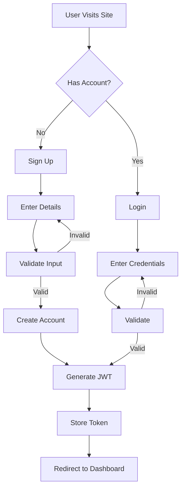
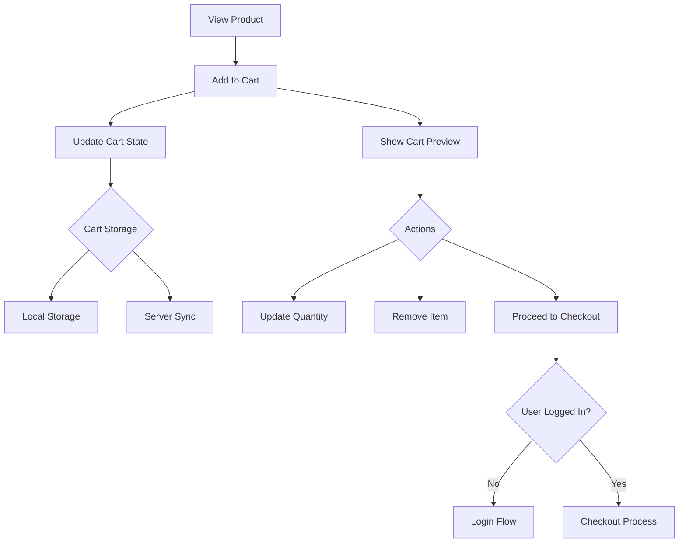
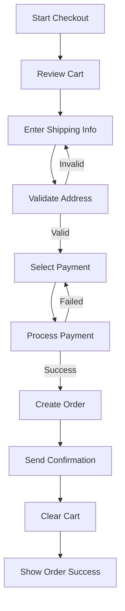
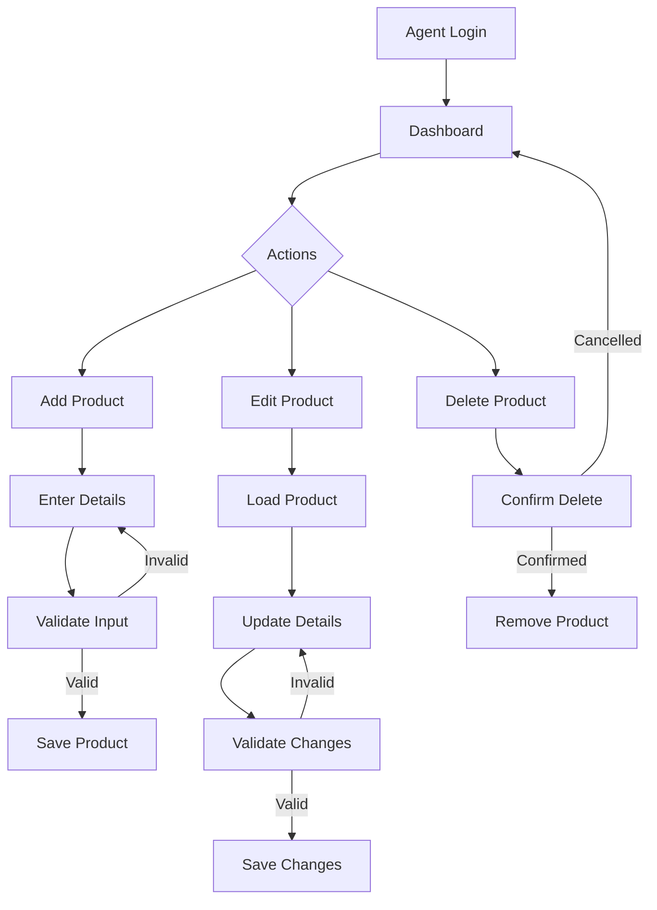
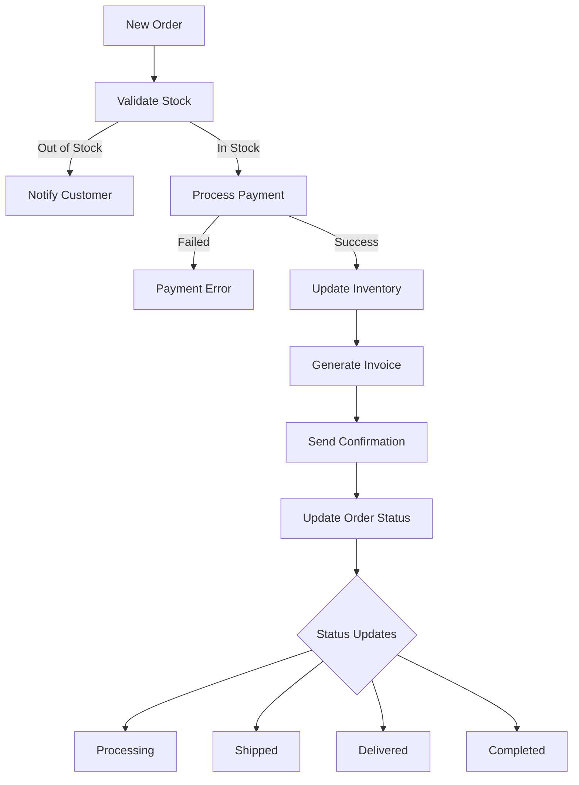
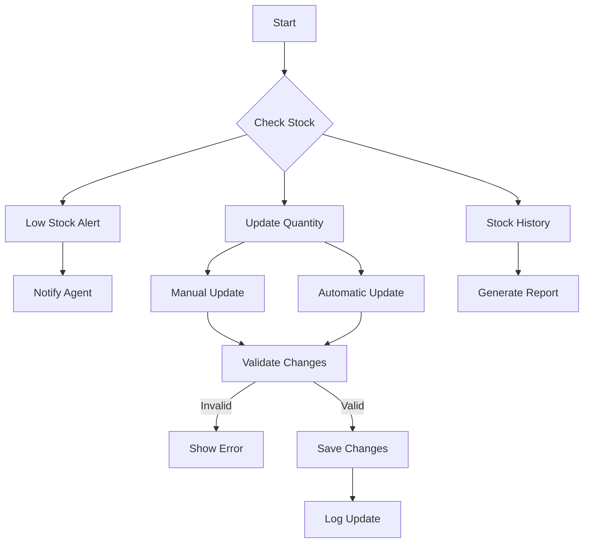

# SupaGrocery Technical Documentation

## Table of Contents
1. [Architecture Overview](#architecture-overview)
2. [Component Design](#component-design)
3. [Data Models](#data-models)
4. [API Documentation](#api-documentation)
5. [Development Guidelines](#development-guidelines)
6. [Testing Strategy](#testing-strategy)
7. [Deployment Process](#deployment-process)
8. [Security Considerations](#security-considerations)
9. [Performance Optimization](#performance-optimization)
10. [Troubleshooting Guide](#troubleshooting-guide)

## Architecture Overview

### System Architecture
The SupaGrocery platform follows a client-server architecture with the following key components:

- **Frontend Layer**: 
  - Static HTML/CSS/JS served via Vercel's edge network
  - React-based SPA with client-side routing
  - Responsive design using Tailwind CSS
  - State management with Redux Toolkit
  - PWA capabilities for offline support

- **API Layer**: 
  - Serverless functions handling business logic
  - Node.js runtime environment
  - Express.js middleware framework
  - RESTful API design principles
  - Rate limiting and request validation

- **Data Layer**: 
  - In-memory storage (mock database)
  - Structured data models
  - ACID transaction support
  - Data validation middleware
  - Caching layer for performance

### Key Design Decisions
- **Stateless Architecture**: 
  - All API endpoints are designed to be stateless
  - Session management via JWT tokens
  - Distributed caching for scalability
  - No server-side session storage
  - Horizontal scaling support

- **Edge Computing**: 
  - Leveraging Vercel's edge network for optimal performance
  - Global CDN distribution
  - Automatic SSL/TLS encryption
  - Edge caching strategies
  - Regional failover support

- **Progressive Enhancement**: 
  - Core functionality works without JavaScript
  - Graceful degradation support
  - Semantic HTML structure
  - ARIA attributes for accessibility
  - Server-side rendering capability

- **Mobile-First Design**: 
  - Responsive design principles applied throughout
  - Touch-friendly interfaces
  - Optimized asset loading
  - Offline capabilities
  - Native-like experience

### Technical Stack Details

#### Frontend Technologies
- **Core Framework**: React 18.x
- **State Management**: Redux Toolkit 1.9.x
- **Styling**: Tailwind CSS 3.x
- **Build Tool**: Vite 4.x
- **Testing**: Jest + React Testing Library
- **Package Manager**: pnpm
- **Code Quality**:
  - ESLint with Airbnb config
  - Prettier
  - TypeScript 5.x
  - Husky pre-commit hooks

#### Backend Technologies
- **Runtime**: Node.js 18.x LTS
- **Framework**: Express.js 4.x
- **API Documentation**: OpenAPI/Swagger
- **Validation**: Joi/Zod
- **Security**:
  - Helmet.js
  - CORS
  - Rate limiting
  - Input sanitization

#### Development Tools
- **Version Control**: Git + GitHub
- **CI/CD**: GitHub Actions
- **Monitoring**: 
  - Sentry for error tracking
  - New Relic for performance
  - LogRocket for session replay
- **Analytics**: 
  - Google Analytics 4
  - Custom event tracking

## Flow Charts

### User Authentication Flow


### Shopping Cart Flow


### Checkout Process Flow


### Product Management Flow


### Order Processing Flow


### Inventory Management Flow


## Component Design

### Frontend Components

1. **Product Listing**
   - **Implementation Details**:
     ```typescript
     interface ProductListProps {
       category?: string;
       sortBy?: 'price' | 'name' | 'date';
       pageSize?: number;
       filters?: FilterOptions;
     }
     ```
   - **Key Features**:
     - Virtual scrolling for large lists
     - Debounced search input
     - Skeleton loading states
     - Error boundary implementation
     - Retry mechanism for failed requests

2. **Shopping Cart**
   - **State Management**:
     ```typescript
     interface CartState {
       items: CartItem[];
       total: number;
       currency: string;
       discounts: Discount[];
       shipping: ShippingOption[];
     }
     ```
   - **Storage Strategy**:
     - IndexedDB for offline support
     - Redux persistence
     - Server synchronization
     - Conflict resolution
     - Automatic recovery

3. **Checkout Flow**
   - **Form Management**:
     - React Hook Form
     - Yup validation schema
     - Address verification
     - Payment gateway integration
     - Order summary calculation
   - **Security Measures**:
     - PCI compliance
     - Data encryption
     - Secure form fields
     - 3D Secure support
     - Fraud detection

### Backend Components

1. **Authentication Service**
   - **JWT Configuration**:
     ```javascript
     const jwtConfig = {
       expiresIn: '24h',
       algorithm: 'RS256',
       issuer: 'supagrocery-api',
       audience: ['web-client', 'mobile-app']
     };
     ```
   - **Security Features**:
     - Password hashing (bcrypt)
     - Rate limiting
     - IP blocking
     - Session management
     - Refresh token rotation

2. **Product Service**
   - **Caching Strategy**:
     ```javascript
     const cacheConfig = {
       ttl: 3600,
       checkPeriod: 600,
       deleteOnExpire: true,
       maxKeys: 1000
     };
     ```
   - **Search Implementation**:
     - Elasticsearch integration
     - Fuzzy matching
     - Category filtering
     - Price range filtering
     - Sorting algorithms

3. **Order Service**
   - **State Machine**:
     ```typescript
     type OrderStatus =
       | 'pending'
       | 'processing'
       | 'shipped'
       | 'delivered'
       | 'cancelled';
     ```
   - **Event System**:
     - Order status updates
     - Inventory management
     - Email notifications
     - SMS notifications
     - Webhook integrations

## Data Models

### Product Schema
```javascript
{
  id: string,
  name: string,
  description: string,
  price: number,
  category: string,
  inventory: number,
  created_at: timestamp,
  updated_at: timestamp
}
```

### Order Schema
```javascript
{
  id: string,
  user_id: string,
  items: Array<{
    product_id: string,
    quantity: number,
    price: number
  }>,
  total: number,
  status: string,
  shipping_address: Address,
  created_at: timestamp
}
```

### User Schema
```javascript
{
  id: string,
  email: string,
  role: 'customer' | 'agent',
  created_at: timestamp
}
```

## API Documentation

### Authentication Endpoints

#### POST /api/auth/login
Login endpoint for both customers and agents.

Request:
```javascript
{
  "email": string,
  "password": string
}
```

Response:
```javascript
{
  "token": string,
  "user": User
}
```

### Product Endpoints

#### GET /api/products
Retrieve products with filtering and pagination.

Query Parameters:
- `page`: number (default: 1)
- `limit`: number (default: 20)
- `category`: string (optional)
- `search`: string (optional)
- `sort`: 'price_asc' | 'price_desc' | 'name_asc' | 'name_desc'

Response:
```javascript
{
  "products": Array<Product>,
  "total": number,
  "page": number,
  "pages": number
}
```

## Development Guidelines

### Code Style
- Use ES6+ features
- Follow airbnb-base style guide
- Use meaningful variable names
- Comment complex logic
- Keep functions small and focused

### Git Workflow
1. Create feature branches from `main`
2. Use conventional commits
3. Require code review for PRs
4. Squash commits when merging
5. Delete branches after merge

### Best Practices
- Write unit tests for new features
- Update documentation
- Optimize assets
- Handle errors gracefully
- Log important events

## Testing Strategy

### Unit Testing
- Test individual components
- Mock external dependencies
- Focus on edge cases
- Maintain high coverage

### Integration Testing
- Test component interactions
- Verify API contracts
- Test error scenarios
- Check data flow

### End-to-End Testing
- Test critical user flows
- Cross-browser testing
- Mobile responsiveness
- Performance testing

## Deployment Process

### Development
1. Run local development server
2. Test changes
3. Commit and push

### Staging
1. Automatic deployment to staging
2. Run integration tests
3. Manual QA testing

### Production
1. Create release PR
2. Run full test suite
3. Deploy to production
4. Monitor metrics

## Security Considerations

### Authentication
- JWT token expiration
- HTTPS only
- Secure cookie settings
- Rate limiting

### Data Protection
- Input validation
- XSS prevention
- CSRF protection
- SQL injection prevention

### API Security
- Authentication required
- Role-based access
- Request validation
- Error handling

## Performance Optimization

### Frontend
- **Code Splitting**:
  ```javascript
  const ProductDetail = lazy(() => import('./ProductDetail'));
  const ShoppingCart = lazy(() => import('./ShoppingCart'));
  ```
- **Asset Optimization**:
  - Image compression
  - WebP format usage
  - Lazy loading
  - Responsive images
  - Font subsetting

### Backend
- **Query Optimization**:
  ```javascript
  const queryConfig = {
    maxLimit: 100,
    defaultLimit: 20,
    cacheDuration: 300,
    indexedFields: ['name', 'category', 'price']
  };
  ```
- **Caching Strategy**:
  - Redis implementation
  - Cache invalidation
  - Cache warming
  - Partial cache updates
  - Cache hit ratio monitoring

### Monitoring and Analytics
- **Performance Metrics**:
  ```javascript
  const metrics = {
    ttfb: 'Time to First Byte',
    fcp: 'First Contentful Paint',
    lcp: 'Largest Contentful Paint',
    fid: 'First Input Delay',
    cls: 'Cumulative Layout Shift'
  };
  ```
- **Error Tracking**:
  - Stack trace collection
  - User context
  - Environment data
  - Performance impact
  - Error grouping

## Troubleshooting Guide

### Common Issues

#### API Errors
- Check authentication
- Verify request format
- Check rate limits
- Review logs

#### Frontend Issues
- Clear cache
- Check console errors
- Verify API responses
- Check browser compatibility

#### Deployment Issues
- Check build logs
- Verify environment variables
- Check dependencies
- Review configuration 